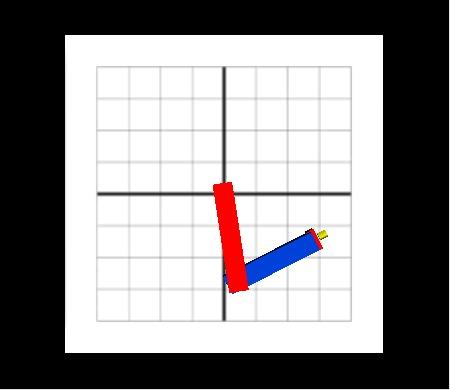

# Serial Two-Joint Robot Manipulator Simulation and Control

This project implements real-time control algorithms for a serial two-joint robotic manipulator using a **Software-in-the-Loop (SIL)** approach. It features a complete simulation environment in LabVIEW with 3D visualization, coupled with a Python-based computer vision interface for hand gesture control.



---

## Quick Start

### Prerequisites
*   **LabVIEW 2014** (or newer) with **Robotics Module**
*   **Python 3.8+**
*   **Webcam** (for computer vision modes)

### Installation
1.  Clone the repository.
2.  Install the required Python dependencies:
    ```bash
    pip install -r requirements.txt
    ```
3.  Ensure `python` is in your system PATH so LabVIEW can execute the script.

### Running the Project
1.  Open **`src/PROJEKAT RUKE-final.vi`** in LabVIEW.
2.  **Run the VI**.
    *   The system will automatically launch the Python computer vision interface (`CV_and_PointPicker.py`) when needed.
    *   No manual script execution is required.

---

## Features

*   **Multi-Mode Control**:
    *   **Manual (Sliders)**: Direct control of X/Y coordinates via Front Panel.
    *   **Joystick (HID)**: Intuitive control using a connected game controller.
    *   **Path Following**: Automated execution of predefined paths (Circle, Square, Triangle).
    *   **Computer Vision**: Control the robot arm using hand gestures (Index Finger tracking).
    *   **Drawing Mode**: Draw a path on screen for the robot to replicate.
*   **Advanced Control Algorithms**:
    *   **PID Controller**: Baseline control with tunable P, I, D parameters.
    *   **Fuzzy-PID**: Adaptive controller that tunes PID parameters in real-time based on error dynamics.
    *   **Sliding Mode Control (SMC)**: Robust nonlinear control for high precision.
*   **Visualization**:
    *   Real-time **3D simulation** of the robot arm.
    *   Live plotting of position, velocity, and error.

---

## System Architecture

The software is built on the **Producer-Consumer** design pattern to ensure deterministic control loop execution separate from UI handling.

*   **LabVIEW (Consumer)**: Handles the physics engine, kinematics/dynamics calculations, and control loop execution (PID/SMC/Fuzzy).
*   **Python (Producer/External)**: Processes camera input using **OpenCV** and **MediaPipe**, sending normalized coordinates to LabVIEW via **UDP (Port 1122)**.

### Communication
The Python script sends coordinates as a 1D array of ordered pairs:
`[normalized_x, normalized_y]` $\rightarrow$ **UDP** $\rightarrow$ **LabVIEW**

---

## Theoretical Background

### Mathematical Model
The system simulates a 2-DOF planar robot arm.
*   **Kinematics**: Forward and Inverse kinematics calculate joint angles ($q_1, q_2$) from Cartesian coordinates $(x, y)$.
*   **Dynamics**: Modeled using the Lagrangian formulation ($L = T - V$) to derive torque equations.

### Control Strategies
| Controller | Description | Pros | Cons |
| :--- | :--- | :--- | :--- |
| **PID** | Classical Proportional-Integral-Derivative | Simple, widely used | Struggles with system nonlinearity |
| **Fuzzy PID** | Fuzzy logic adjusts $K_p$ based on error | Better handling of nonlinearity | Complex tuning of membership functions |
| **SMC** | Sliding Mode Control | High robustness & precision | Sensitive to loop delays (chattering) |

For a deep dive into the mathematical derivations and control theory, please refer to the full **[Project Documentation (PDF)](docs/UARV%20projekat%20-%20dokumentacija.pdf)**.

---

## Project Structure

```text
├── docs/                   # Documentation and diagrams
├── src/
│   ├── PROJEKAT RUKE-final.vi      # MAIN ENTRY POINT
│   ├── CV_and_PointPicker.py       # Python Vision Script
│   ├── PID final controller.vi     # PID Logic
│   ├── SMC.vi                      # Sliding Mode Logic
│   ├── fuzzyT1.fs                  # Fuzzy Logic System definition
│   └── ...                         # Helper VIs (Kinematics, Math)
├── requirements.txt        # Python dependencies
└── README.md
```

## Credits

Developed at the **University of Novi Sad, Faculty of Technical Sciences**, Department of Computing and Control.

**Authors:**
*   Šećerov Nemanja
*   Demirović Emina
*   Grković Dušan
*   Tokić Ilija

**Mentors:**
*   Prof. dr Željko Kanović
*   Gluhović Mihailo
*   Golić Anastasija
