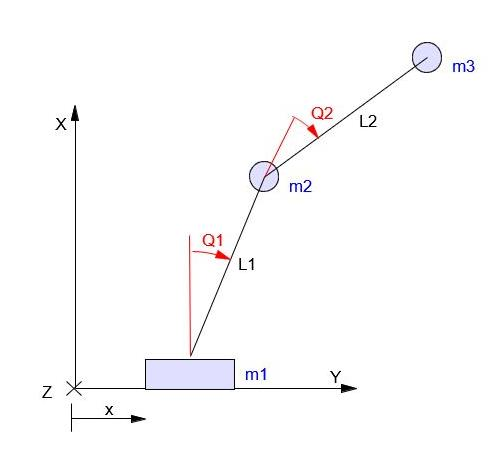
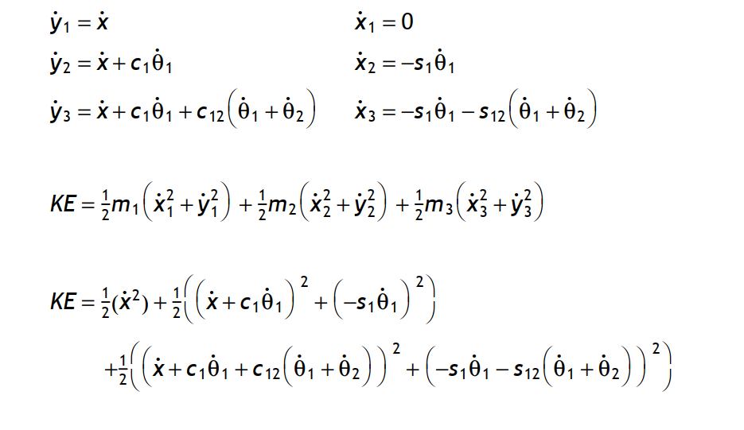
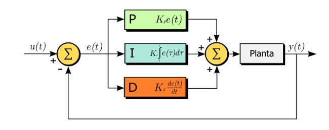
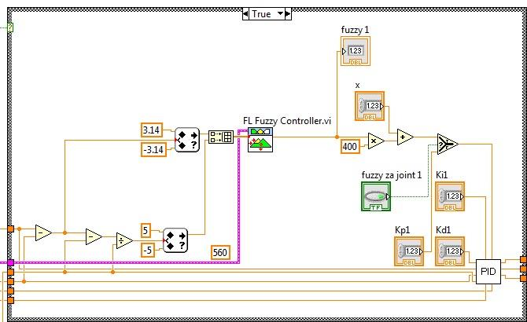
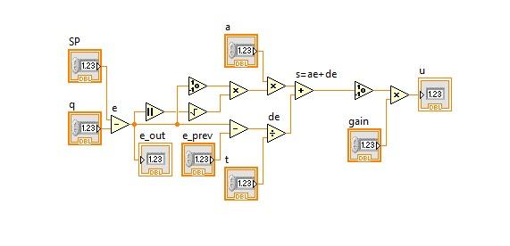
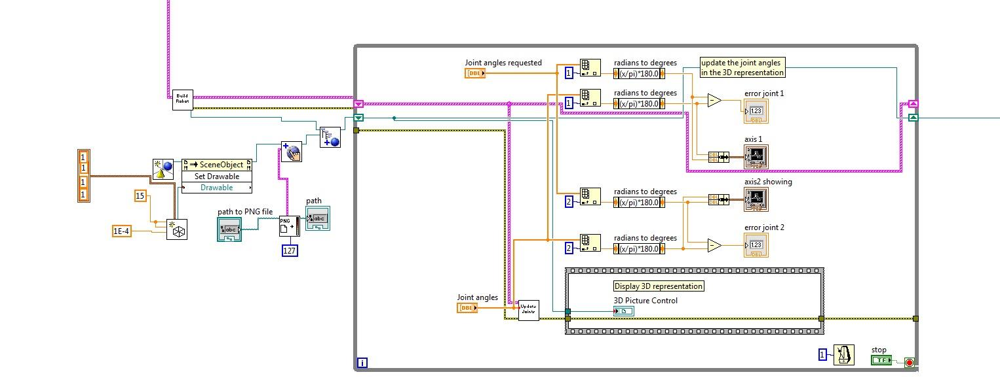
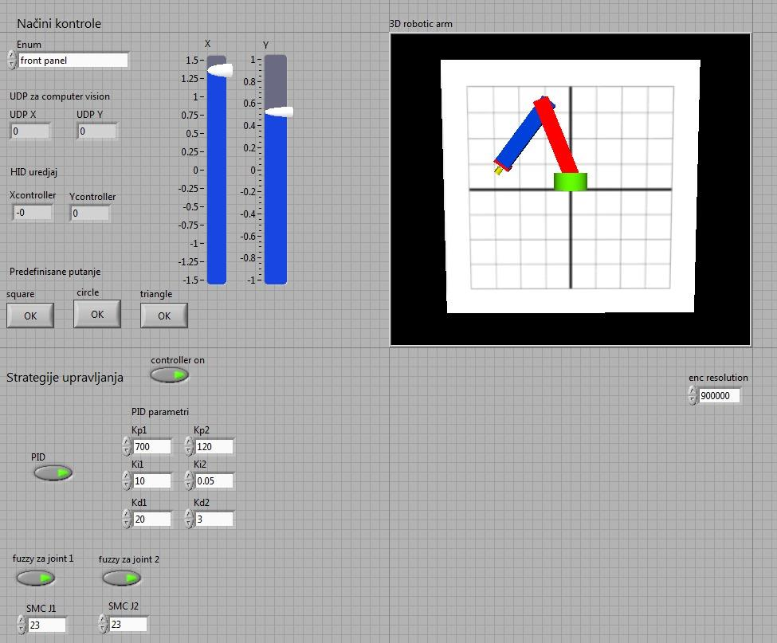
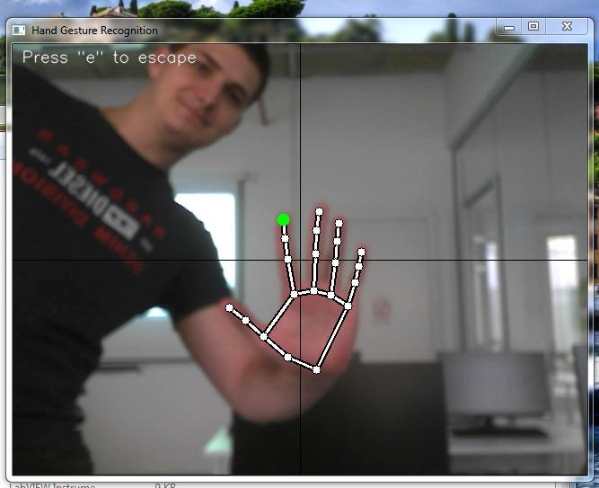
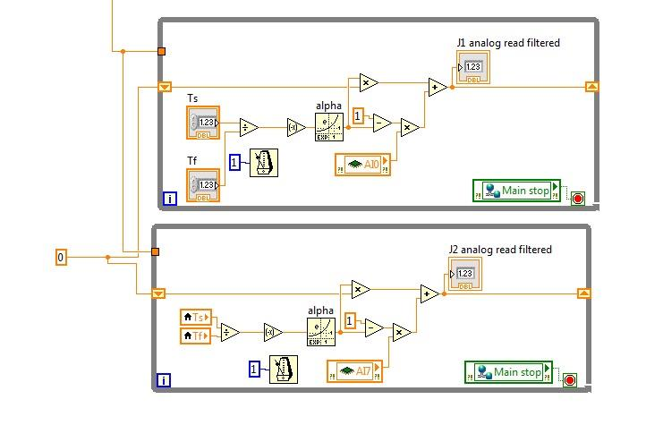

# Serial Two-Joint Robot Manipulator Simulation and Control

This project focuses on real-time control algorithms for a serial two-joint robotic manipulator using a Software in the Loop (SIL) approach. It was developed at the University of Novi Sad. The goal was to model, simulate and control a robot arm using standard and advanced control strategies.

## Motivation

Robotic arms are essential in many industries. They perform complex tasks with high precision. However, controlling them is difficult. They are nonlinear systems that need fast reactions. This project tackles those challenges by building reliable control algorithms.

## Project Goals

We had several specific objectives.

*   Create a mathematical model of the robot arm.
*   Design and test PID and fuzzy controllers.
*   Simulate the system in LabVIEW.
*   Test the control on National Instruments hardware.
*   Build a user interface for easy control.

## Mathematical Model

The model consists of a base and two joints. We analyzed the kinematics and dynamics. Kinematics describes the motion in space. Dynamics looks at the forces and torques needed to move the arm.

## Control Strategies

We tested different ways to control the arm.

### PID Control

We started with conventional PID control. We tuned the parameters to get stable movement. It worked but had some issues with steady-state accuracy due to the system's nonlinearity.

### PID with Fuzzy Tuning

To improve the standard PID, we added a fuzzy logic controller. It adjusts the PID parameters automatically based on errors. This improved the performance and made the system more robust.

### Sliding Mode Control (SMC)

We also implemented Sliding Mode Control. This method is good for nonlinear systems. It forces the system state to slide along a defined surface. This handles uncertainty better than standard PID.

## User Interface and Simulation

We built the simulation and interface in LabVIEW.

### 3D Visualization

The interface shows a 3D view of the robot arm moving in real time. It uses LabVIEW's graphics libraries to render the joints and segments.

### Control Panel

The front panel lets you control the robot manually. You can use sliders or a joystick. There are also automatic modes to make the arm follow shapes like circles or triangles.

### Computer Vision Control

We added a feature to control the robot with hand gestures. It uses Python with OpenCV and MediaPipe. The system tracks your hand position and moves the robot to match.

## Hardware Implementation

We moved the simulation to real hardware using NI sbRIO and cRIO platforms. These allow for real-time processing. Real signals have noise, so we implemented first-order filters to clean up the inputs and outputs.

## Results and Comparison

We used the Software in the Loop (SIL) simulation to compare the three control strategies.

*   **PID Control:** This served as our baseline. It was stable but struggled with precision because of the system's nonlinear nature.
*   **Sliding Mode Control (SMC):** This method was the best performer in the simulation. It was highly accurate. However, it is sensitive to delays, which makes it challenging for real hardware implementation.
*   **Fuzzy PID:** This proved to be the best practical choice for this nonlinear system. It handled the dynamics well and improved significantly upon the standard PID.

The simulation confirmed the control logic was sound. Hardware tests demonstrated the concepts effectively, though real-world factors like noise and delays made them less precise than the SIL simulation.

## Requirements

*   Python 3.8
*   LabVIEW 2014 or newer
*   LabVIEW Robotics module
*   Python libraries (OpenCV, mediapipe, numpy)

## Credits

**Authors**
*   Šećerov Nemanja
*   Demirović Emina
*   Grković Dušan
*   Tokić Ilija

**Mentors**
*   Prof. dr Željko Kanović
*   Gluhović Mihailo
*   Golić Anastasija
